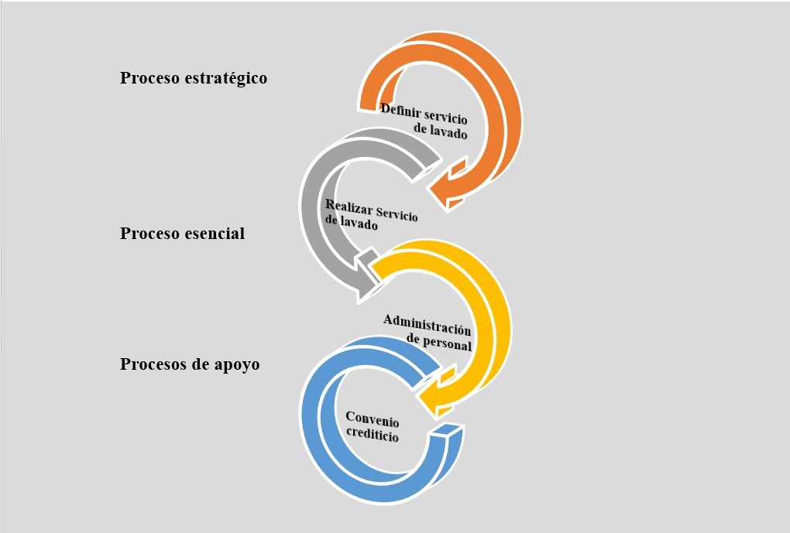
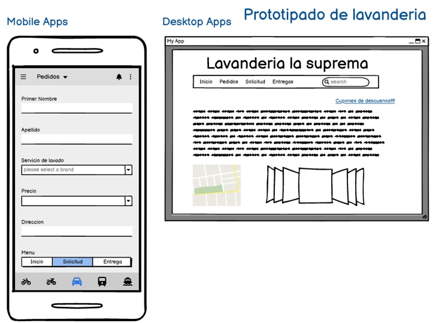
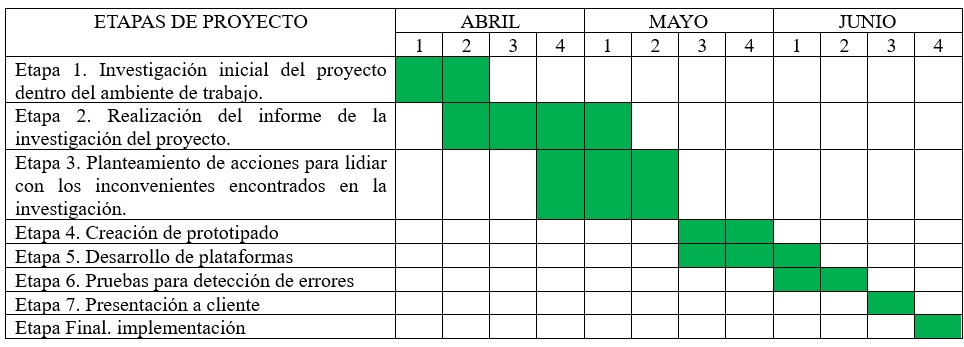
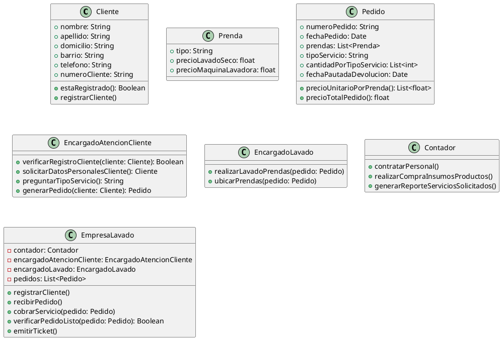

>UNIVERSIDAD MARIANO GALVEZ DE GUATEMALA
FACULTAD DE INGENIERIA EN SISTEMAS
CENTRO REGIONAL BOCA DEL MONTE
CURSO: ANALISIS DE SISTEMAS 1 SECCION “A”
CATEDRATICO: ING. MELVIN CALI

#

# PROYECTO 1

#

>PEDRO LUIS DE JESUS HERNANDEZ LOPEZ 	7690-20-16633

>YONI ROBERTO CUSTODIO LÓPEZ 			7690-20-13876

>EMMANUEL ALEJANDRO HERRERA MELGAR 	7690-20-13876
>JOSE DANIEL GOMEZ MEDINA 		    7690-20-13785
GUATEMALA 17 DE FEBRERO DE 2023
#
#
## Documentación de requerimientos

>Una organización dedicada a ofrecer el servicio de lavado realiza distintos tipos de servicio (referidos a distintas formas de lavado: lavado a seco, con máquina lavadora, etc.) a las prendas que habitualmente traen sus clientes. Cuando un cliente llega, el encargado de atención al cliente le consulta si ya es cliente y verifica si se encuentra registrado. Caso contrario, le solicitan sus datos personales: apellido y nombre, domicilio (calle, número, apartamento y piso), barrio y teléfono, para realizar su registro asignándole un número de cliente.

>A continuación, se le pregunta el tipo de servicio que va a aplicar a cada una de las prendas que deja. Se genera un pedido con los siguientes datos: número de pedido, fecha de pedido, los tipos de prendas, tipo de servicio para cada prenda, la cantidad de prendas que deja por cada tipo de servicio y fecha pautada de devolución. Se le informa al cliente el precio unitario de cada servicio por cada prenda, y el precio total del pedido. El formulario de pedido que se realiza por duplicado, entregándole el original al cliente.

>En general un tipo de servicio puede aplicarse a cualquier tipo de prenda, y el precio del servicio depende del tipo de servicio y del tipo de prenda. Por ejemplo:

| Tipo de servicio: | Lavado a Seco | Maquina Lavadora  |
|----------|----------|----------|
| Blusa    | Q.150  | Q.110   |
| Alcolchado    |  Q.380  | Q.300   |

>El encargado de lavado procede a realizar el lavado de las prendas y una vez listo, las ubica para su retiro. El personal es contrato por el contador de la lavandería. Cuando el cliente llega a retirar las prendas, se verifica que el pedido esté listo, se le emite un ticket y se le cobra el servicio. El ticket se emite según reglamentación vigente de la SAT. Se acepta únicamente pago de contado.

>El cliente tiene 90 días a partir de la fecha de entrega pactada para retirar las prendas, pasado ese plazo la empresa puede disponer de las mismas. En forma semanal se realiza la compra de insumos y productos para poder realizar el lavado de las prendas. Mensualmente se genera un reporte con los tipos de servicios de lavado de prendas más solicitados.

## Análisis
>Propuesta Identificación de procesos y tipos (casos limitados: solo algunos procesos como ejemplo)

*	Servicio de lavandería --------------------- Proceso Esencial (crítico para el negocio)

*	Compra de suministros e insumos-------- Proceso de Apoyo

*	Servicio de lavado -------------------------- Proceso Estratégico

*	Personal -------------------------------------- Proceso de Apoyo

*	Entidad crediticia --------------------------- Proceso de Apoyo

# Mapa de Proceso

# Procesos y Objetivos
| Nombre del Proces | Objetivo 
|----------|----------|
| Definir servicios de lavadoRow 2    | Identificar los servicios de lavandería ofrecidos, los precios y políticas correspondientes.  | 
| Realizar servicio de lavado         | Lavar la ropa suministrada por el cliente por la tarifa correspondiente. | 
|  Personal          | Administra personal relacionado con las actividades de la organización.   |
|   Convenio crediticio                     | Crea y gestiona convenios con empresas de tarjetas de crédito y débito. 

# Descripción de proceso de negocio
## Proceso de negocio: Servicio de lavado
| Objetivo | Lave la ropa suministrada por el cliente por la tarifa correspondiente.| |
|----------|----------|----------|
| Cliente del proceso  | Usuario, persona quien solicite el servicio de lavado de prendas.  |    
|Producto del proceso    | Prendas lavadas y cobradas de acuerdo al servicio prestado al cliente.  |  
## Proveedores del proceso e insumos que brinda cada uno
| Proveedor | Insumo |
|----------|----------|
| Proceso definir servicios de lavado    | Información de servicios, precios y formas de pago  | 
| Proceso compra de productos e insumos   | Productos e insumos para el lavado de prendas  | 
| Proceso administrativo de convenios con entidades crediticias    | Información de tarjetas habilitadas para cobrar al cliente  |  
| Entidades crediticias    | Autorización de operación con tarjeta   |

# 
>Recursos del proceso RRHH: 
*	Encargado de atención al cliente.
*	Encargado de lavado
Recursos tecnológicos
*	No especificado

## Formularios, registros e información del proceso

| Formularios | Registros e información | 
|----------|----------|
| Comprobante de pedido    | Datos de cliente  | 
| Ticket    | Información de servicios y precios   | 
| Cupon de tarjeta crédito/ debito    | Formas de pago  | 
| Row 3    | Pedidos de servicio de lavado   |
|     | Prendas lavadas  |
|     | Cobros y entregas   |
 
 ## Reglas de negocio
 *	Pasado 90 días de la fecha de entrega pacada se pierde el derecho a retirar las prendas.
*	Las formas de pago aceptadas son en efectivo o con tarjeta de crédito / debito.
*	La fecha posible de entrega se calcula considerando dos días hábiles a partir de la fecha de entrega de la prenda.

## Restricciones 
 *	El ticket se emite según reglamentación vigente de la SAT.
*	Reglamentación vigente para generar cupón de cobro con tarjeta de crédito / debito.

## Listado de actividades del proceso
*	Tomar pedido del cliente
*	Tomar datos del cliente
*	Realizar lavado de prendas
*	Preparar prendas para su entrega
*	Receptar pedido de retiro del cliente
*	Verificar pedido preparado (prendas lavadas o con inconvenientes)
*	Cobrar servicio por prendas lavadas en efectivo o con tarjeta
*	Generar ticket de cobro
*	Entregar prendas al cliente

|Observaciones | Puede ocurrir que las prendas no puedan ser lavadas por algún percance o inconveniente, en tal caso se devuelven las prendas sin la realización del servicio y no se realizara ningún cobro. | 
|----------|----------|

>Nota: La observación dada en el modelo no es una excepción, sino que se considera en la fase de modelado del proceso como una alternativa derivada de la situación de dicho proceso. Si no se lavaron prendas. Esta es una consideración opcional.

## Diseño Prototipado
Link de diseño: https://balsamiq.cloud/s362f4z/p9gb64a

## Etapas del proyecto

>Para aplicar la metodología Scrum en este escenario, vamos a seguir el siguiente proceso:
Creamos el Product Backlog:
Product Backlog:
1.	Registro de clientes:
*	Sistema de registro de nuevos clientes.
*	Formulario para la recolección de datos personales (nombre, apellido, dirección, teléfono).
*	Generar un número de cliente único y asignarlo a cada nuevo registro.
*	Sistema de verificación de clientes existentes.
2.	Servicios de lavado:
*	Definir distintos tipos de servicio de lavado (lavado a seco, con máquina lavadora, etc.).
*	Asociar un precio unitario a cada servicio de lavado y por tipo de prenda.
*	Definir los distintos tipos de prendas que se lavan en la lavandería.
*	Generar un formulario de pedido para cada servicio solicitado por el cliente.
*	Registrar la cantidad de prendas que el cliente deja por cada tipo de servicio.
3.	Proceso de lavado:
*	Asignar a un encargado de lavado que se encargue de procesar los pedidos.
*	Ubicar las prendas para su lavado y posterior retiro.
*	Contratar personal para el proceso de lavado.
4.	Proceso de retiro:
*	Verificación de que el pedido esté listo para su retiro.
*	Emitir un ticket de retiro.
*	Cobro del servicio de lavado.
*	Aceptar únicamente pago en efectivo.
*	Definir un plazo de 90 días para el retiro de las prendas.
5.	Compras e insumos:
*	Realizar compras de insumos y productos semanalmente para la realización del lavado.
*	Registro de inventario de productos e insumos.
6.	Reportes:
*	Generar reportes mensuales de los tipos de servicios de lavado más solicitados.
*	Análisis de la demanda de los distintos tipos de servicio de lavado.
*	Identificar oportunidades de mejora y crecimiento del negocio.

Para realizar las pruebas utilizaremos Jest y Mocha, llevando a cabo las siguientes pruebas:
1.	Prueba de registro de clientes: se puede verificar que, al ingresar los datos de un cliente, se le asigne un número de cliente único y se almacenen correctamente los datos ingresados.
2.	Prueba de generación de pedidos: Verifica que, al generar un pedido, se almacenen correctamente los datos del pedido (número de pedido, fecha de pedido, tipos de prendas, tipo de servicio para cada prenda, cantidad de prendas y fecha pautada de devolución), se calcule el precio total del pedido correctamente y se entregue el formulario de pedido al cliente.
3.	Prueba de cálculo de precios: se puede verificar que el cálculo de precios unitarios y totales se realiza correctamente en función del tipo de servicio y del tipo de prenda.
4.	Prueba de lavado de prendas: se puede verificar que, al recibir un pedido, el encargado de lavado proceda a realizar el lavado de las prendas correctamente y las ubique para su retiro.
5.	Prueba de emisión de ticket y cobro de servicio: se puede verificar que al retirar las prendas, se emita un ticket y se cobre el servicio correctamente, según la reglamentación vigente de la SAT.
6.	Prueba de tiempo de retiro de prendas: se puede verificar que, después de 90 días a partir de la fecha de entrega pactada, las prendas puedan ser dispuestas por la empresa.
7.	Prueba de reporte mensual: se puede verificar que se genere un reporte mensual con los tipos de servicios de lavado de prendas más solicitados.

Diagrama de Clases UML

>Cliente *-- Pedido
>Pedido *-- Prenda
>EmpresaLavado o-- Contador
>EmpresaLavado o-- EncargadoAtencionCliente
>EmpresaLavado o-- EncargadoLavado
>EmpresaLavado o-- Pedido

>El diagrama UML muestra las clases involucradas en el proceso de lavado de prendas, sus atributos y métodos.
*	La clase Cliente representa a cada uno de los clientes de la lavandería. Cada cliente tiene un número de cliente, nombre, apellido, dirección y número de teléfono.
*	La clase Pedido representa cada uno de los pedidos que realiza un cliente. Cada pedido tiene un número de pedido, fecha de pedido, fecha de devolución, una lista de prendas, una lista de servicios aplicados a cada prenda, y la cantidad de prendas por servicio.
*	La clase Prenda representa a cada una de las prendas que un cliente deja para lavar. Cada prenda tiene un tipo de prenda y un precio unitario para cada tipo de servicio que se le puede aplicar.
*	La clase Servicio representa a cada uno de los tipos de servicio que la lavandería ofrece. Cada servicio tiene un tipo de servicio y un precio unitario para cada tipo de prenda.

